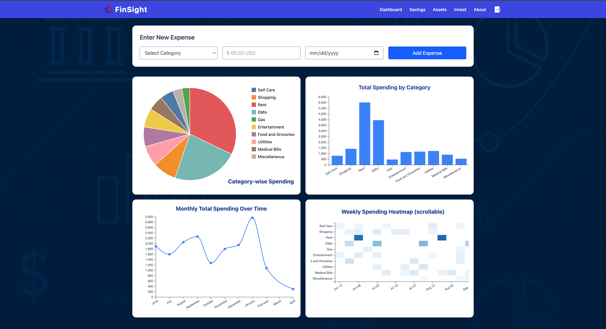

# FinSight

A Smart Visual Analytics Platform for Personal Finance Tracking &amp; Goal-Oriented Investment Planning

## Description

FinSight is an intelligent personal finance platform that helps users track expenses, analyze spending habits, and visualize financial trends through intuitive and interactive dashboards. Beyond expense tracking, it leverages machine learning and real-time asset data to forecast savings and generate personalized investment plans.

By incorporating user risk profiles and market performance, FinSight delivers dynamic, monthly asset allocations across stocks, mutual funds, bonds, crypto, and gold—empowering users to make informed decisions and achieve long-term financial goals with confidence.

## Application Walkthrough

## FinSight Dashboard



## Folder Structure

```bash
FinSight/
├──ml-engine
├──client
├──server
    ├── node_modules/                       # Installed npm packages
    ├── src/                                # Application source code
    │   ├── config/                         # Configuration files (e.g., database, environment) / MongoDB configuration
    │   │   ├── db.js
    │   │   └── appConfig.js
    │   ├── controllers(or)components/      # Application controllers (handling requests)
    │   │   └── userController.js
    │   ├── models/                         # Database models (e.g., Mongoose, Sequelize) / Mongoose schemas
    │   │   └── userModel.js
    │   ├── routes/                         # Route definitions / Express Routes definitions
    │   │   └── userRoutes.js
    │   ├── services/                       # Business logic/services
    │   │   └── userService.js
    │   ├── middleware/                     # Custom middleware
    │   │   └── authMiddleware.js
    │   ├── utils(or)helpers/               # Utility functions/helpers
    │   │   └── logger.js
    │   ├── app.js                          # Main application setup
    │   └── server.js                       # Entry point for starting the server
    ├── tests/                              # Unit and integration tests
    │   └── userController.test.js
    ├── public/                             # Static assets (images, stylesheets, etc.)
    ├── views/                              # Templates (if using a templating engine like EJS, Pug, HBS)
    ├── .env                                # Environment variables    
    ├── package.json                        # NPM dependencies and scripts
    └── package-lock.json                   # Dependency tree lock file 
├──.gitignore                               # Git ignore file
└── README.md                               # Project documentation
```
